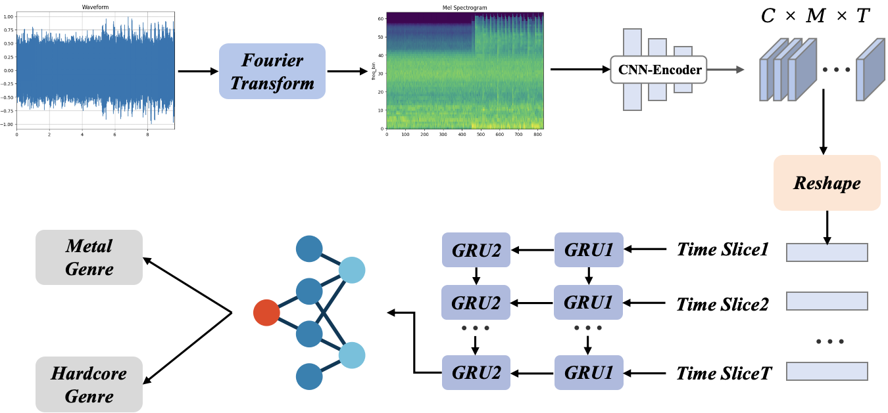
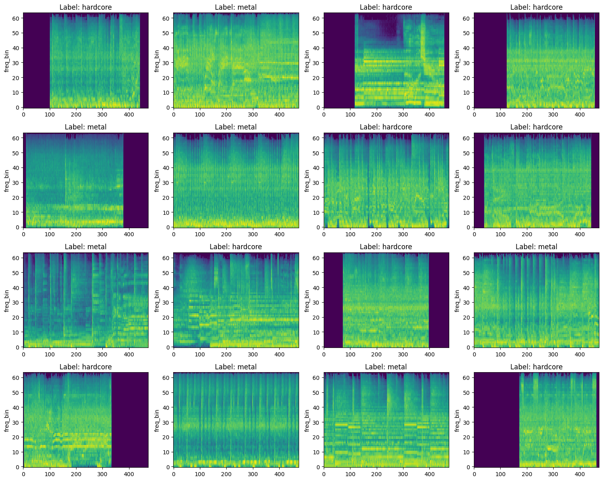

# Fine-Grained Classification of Metal and Hardcore Music Using a Hybrid CNN–GRU Framework


**Fine-Grained Classification of Metal and Hardcore Music Using a Hybrid CNN–GRU Framework**<br/>
[Luyao Helen Yang](https://github.com/heleny1224)<br/>


**tl;dr** Metal and Hardcore sound too similar for normal models to tell apart. I built a CNN + BiGRU model that looks at Mel-spectrograms to capture local texture (CNN) and long rhythmic patterns (BiGRU), and it classifies 12,960 clips of Metal vs Hardcore with 92.40% accuracy — way better than standard methods. Makes automatic tagging of extreme music actually reliable.




## Requirements
- Python 3.10 – 3.12 (tested with 3.11.9)
- PyTorch (tested with 2.x), torchaudio
- Install deps:
```bash
pip install -r requirements.txt
```

## Data preparation

### 1. Raw audio placement

Place your full-length `.wav` or `.mp3` tracks in the following folder structure:

```bash
data_music/
├── metal/
│   ├── ACDC - You Shook Me All Night Long.mp3
│   ├── Agalloch - Falling Snow (2016 - Remaster).mp3
│   ├── Agalloch - The Lodge.mp3
│   └── ...
└── hardcore/
│   ├── A Day to Remember - Right Back At it Again.mp3
│   ├── Adept - Grow Up, Peter Pan.mp3
│   ├── Adept - Secrets.mp3
│   └── ...
```

- You need **exactly two folders**: `metal` and `hardcore` (case-sensitive).
- Any number of tracks (100 metal + 116 hardcore in the paper, but more is fine).
- Supported formats: `.wav`, `.mp3`, `.flac`, `.m4a` — torchaudio handles all of them.

### 2. Run preprocessing

Open `preprocessing.ipynb` and run all cells to:

- Split each track into segments (default: 60 segments)
- Prepare the dataset struture in `data_split/`

**Note**: Mel-spectrograms are generated on-the-fly during training, not saved o disk.



## Model Architecture

Our model is a **CNN-GRU hybrid**:
- **CNN layers**: 3 convolutional layers for local feature extraction
- **GRU layers**: 2 GRU layers for sequential pattern recognition  
- **Input**: 2-channel (stereo) Mel-spectrograms (96×1366)
- **Output**: Binary classification (metal vs hardcore)


## Results

Our CNN-GRU model was trained for 10 epochs and achieved:

| Metric | Validation | Test |
|--------|------------|------|
| Accuracy | 94.89% | 92.40% |
| Precision | - | 92.85% |
| Recall | - | 92.40% |
| F1-Score | - | 92.42% |


**Training details:**
- Dataset: 2-class (metal vs hardcore) audio classification
- Audio preprocessing: 44100 Hz, 5.5s segments, stereo
- Spectrogram: 64 Mel bins, n_fft=1024
- Model: 3×Conv2D → 2×GRU → Linear
- Training time: ~5 minutes on GPU


